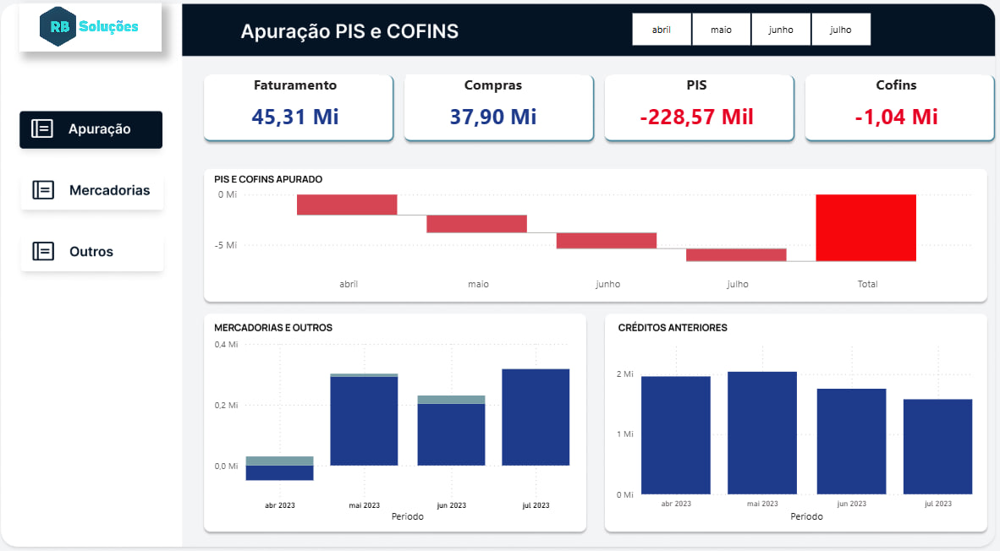
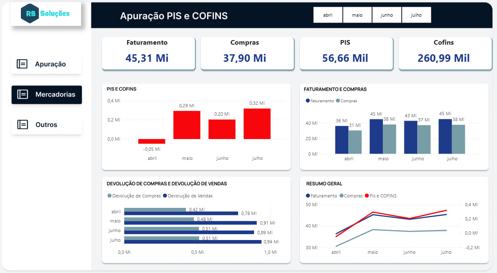
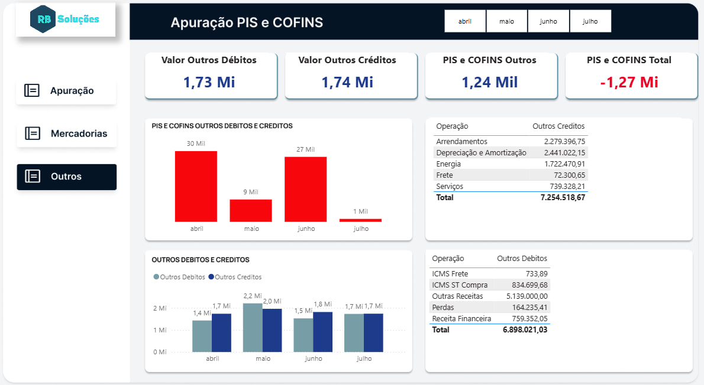

# 📊 Modelo Analítico – Apuração PIS e COFINS

## 🎯 Objetivo

Desenvolver um modelo analítico em Power BI para validação, monitoramento e análise da apuração de PIS e COFINS, a partir de dados extraídos de ERP contendo movimentações de entradas e saídas.

O projeto tem como foco transformar dados fiscais em informações estruturadas para apoio à tomada de decisão e mitigação de riscos tributários.

---

## 🏢 Contexto do Negócio

Empresas com alto volume de operações fiscais enfrentam desafios como:

- Consolidação de créditos e débitos  
- Validação da apuração mensal  
- Controle da evolução tributária  
- Identificação de inconsistências  

Este modelo foi desenvolvido para centralizar, estruturar e analisar essas informações de forma confiável e visual.

---

## 🛠 Tecnologias e Conceitos Aplicados

- Power BI  
- DAX (medidas para apuração e consolidação)  
- Modelagem de Dados  
- Tratamento de dados em Excel  
- Aplicação de regras fiscais de PIS e COFINS  
- Construção de indicadores (KPIs)  

---

## 🧠 Estrutura Analítica

O modelo foi estruturado considerando:

- Base de entradas (compras)  
- Base de saídas (faturamento)  
- Créditos tributários  
- Débitos tributários  
- Consolidação mensal  
- Indicadores executivos  

Foram desenvolvidas medidas para cálculo automatizado de:

- PIS apurado  
- COFINS apurado  
- Total consolidado  
- Evolução por período  
- Comparativos entre faturamento e compras  

---

## 📊 Dashboards Desenvolvidos

### 🔹 Apuração Geral

Painel executivo com visão consolidada de faturamento, compras, PIS e COFINS, incluindo evolução mensal e total acumulado.

---

### 🔹 Análise de Mercadorias

Comparativo entre faturamento e compras, análise de evolução de vendas e acompanhamento de indicadores por período.

---

### 🔹 Outros Débitos e Créditos

Detalhamento de créditos e débitos por natureza (energia, frete, ICMS, receita financeira, entre outros), permitindo análise granular da composição tributária.

---

## 📈 Resultados e Impacto

- Estruturação de modelo analítico fiscal confiável  
- Visão consolidada da apuração tributária  
- Redução de risco por inconsistências  
- Apoio à análise gerencial e estratégica  
- Organização de dados fiscais antes descentralizados  

---

## 💡 Diferencial do Projeto

Este projeto combina:

- Conhecimento técnico em BI  
- Modelagem de dados aplicada  
- Domínio de regra de negócio fiscal  
- Capacidade analítica voltada à decisão  

Não se trata apenas de visualização, mas de aplicação prática de inteligência de negócios no contexto tributário.

---

## 👤 Autor

**Rogério Belo de Abreu**  
Analista de Negócios | Dados | Fiscal  
SQL | Power BI | Automação | Modelagem Analítica  
